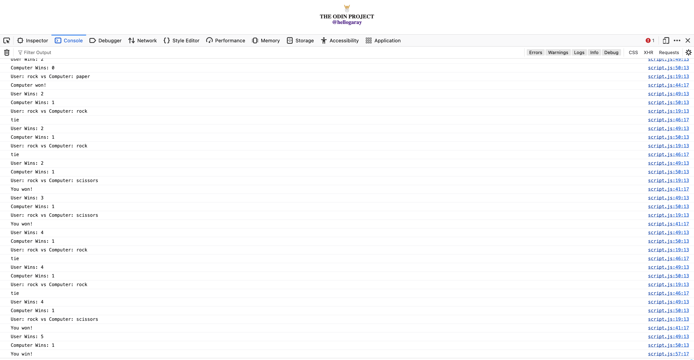

# 🪨📄✂️ Rock Paper Scissors Game

Welcome to the Rock Paper Scissors Game! This is a simple yet thrilling game implemented using HTML, CSS, and JavaScript.

## 📝 Description

This project implements a basic Rock Paper Scissors game where the user can click on one of the choices (rock, paper, or scissors) and play against the computer. The game logic determines the winner based on the choices made by the user and the computer (randomly generated).

## ✨ Features

- Allows the user to play Rock Paper Scissors against the computer.
- Keeps track of the user's score and the computer's score.
- Displays the result of each round and the overall winner when one player reaches a score of 5.

## 🎮 Usage

- Click on one of the choices (rock, paper, or scissors) to make your selection.
- The computer will randomly choose its option.
- The result of the round will be displayed, and the score will be updated accordingly.
- Continue playing until one player reaches a score of 5.

## 🕹️ Original Version

The image above shows the original version of the Rock Paper Scissors game, where the game was played using console logs for user input. In this version, players interacted with the game through the console.
