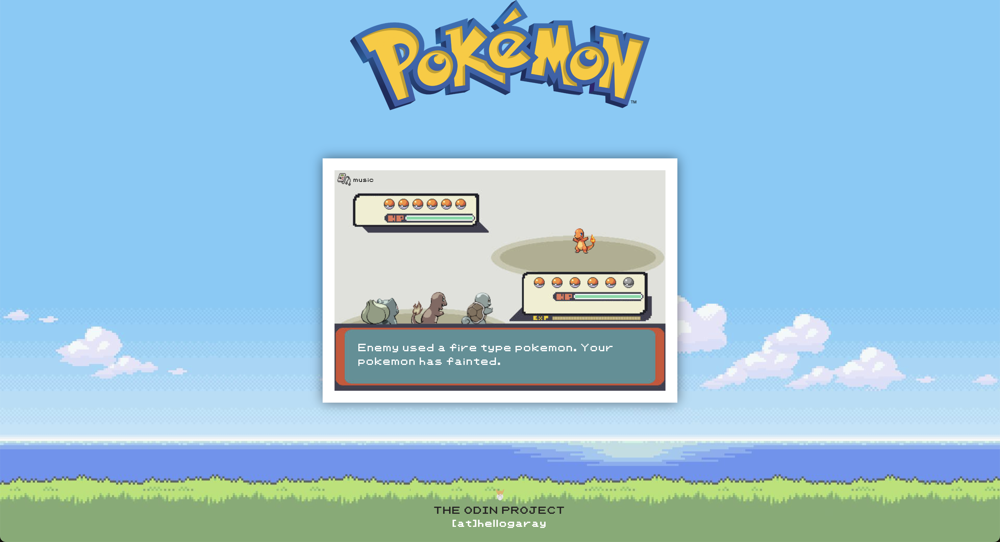

  <h1>Project-Rock-Paper-Scissors </h1>
  
The Odin Project - Landing Page Project

  

    
    
    
  

  
  
  

Welcome to the Rock Paper Scissors Game! This is a simple yet thrilling game implemented using HTML, CSS, and JavaScript.

## 📝 Description

This project implements a basic Rock Paper Scissors game where the user can click on one of the choices (rock, paper, or scissors) and play against the computer. The game logic determines the winner based on the choices made by the user and the computer (randomly generated).

## ✨ Features

- Allows the user to play Rock Paper Scissors against the computer.
- Keeps track of the user's score and the computer's score.
- Displays the result of each round and the overall winner when one player reaches a score of 5.

## 🎮 Usage

- Click on one of the choices (rock, paper, or scissors) to make your selection.
- The computer will randomly choose its option.
- The result of the round will be displayed, and the score will be updated accordingly.
- Continue playing until one player reaches a score of 5.

## 🕹️ Original Version

  

## 🕹️ Final Version

  

The images above show the original and final versions of the Rock Paper Scissors game. The original version uses the console to get the inut from the game and the new version has it's own UI to get input and show the results.
